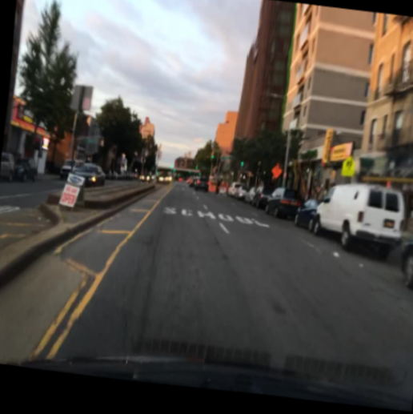
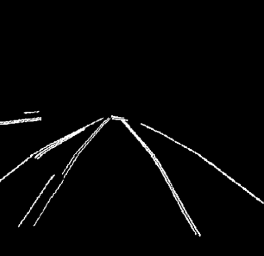
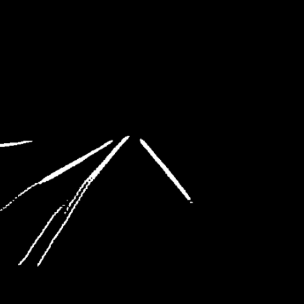

# Lane Detection using Deep Learning (Semantic Segmentation)

This project implements multiple deep learning architectures
for lane segmentation including:

- UNet
- DeepLabV3+
- ESPNet
- TwinLiteNet

The system supports:
- Multi-model training
- Mixed Precision Training (AMP)
- Early Stopping
- Learning Rate Scheduler
- Detailed Metrics (Dice, IoU, F1)
- Full inference pipeline

## 🛠 Tech Stack

- Python
- PyTorch
- Albumentations
- OpenCV
- NumPy
- Matplotlib

## ✨ Engineering Highlights

- Modular architecture with separated models, losses, metrics, and data modules
- Factory pattern for dynamic model selection
- Mixed Precision Training (AMP) for performance optimization
- Early Stopping and ReduceLROnPlateau scheduler
- Clean CLI interface for reproducible experiments
- Structured checkpoint management

## 📂 Dataset

The model was trained and evaluated on the BDD100K lane segmentation dataset.

Images were resized to 512x512 during training.
## 🔁 Reproducibility

Random seeds were fixed to ensure reproducible experiments.
## 🧠  Project Structure

````
project/
│
├── train.py
├── inference.py
│
├── models/
│ ├── __init__.py
│ ├── build.py
│ ├── Deeplabv3plus.py
│ ├── ESPNet_custom.py
│ ├── TwinLiteNet.py
│ └── UNetResnet34_custom.py
│
├── losses/
│ └── combo_loss.py
│
├── metrics/
│ └── metrics.py
│
├── data/
│ ├── lane_dataset.py
│ └── prepare_dataset.py
│
├── assets/
│ ├── demo/
│ │ ├── input.png
│ │ ├── ground_truth.png
│ └─└── output.png
│
├── utils/
│ └── Utils.py
│
└── checkpoints/
````

## 🚀 Training
```bash
python train.py \
--model deeplab \
--train_img_dir path/to/train/images \
--train_mask_dir path/to/train/masks \
--val_img_dir path/to/val/images \
--val_mask_dir path/to/val/masks
```

## 🎯 Inference
```bash
python inference.py \
--model deeplab \
--checkpoint checkpoints/deeplab_best.pth \
--input_dir test_images \
--output_dir results
```
## 🔥 Demo
|  Input Image         | Ground Truth | Output Image                |
|---------------|-----|-----------------------------|
| |  |  |


## 📊 Results
| Model         | Dice | IoU  |
|---------------|------|------|
| UNet-Resnet34 | 0.47 | 0.31 |
| DeepLabV3+    | 0.56 | 0.39 |
| ESPNet        | 0.40 | 0.25 |
| TwinLiteNet   | 0.54 | 0.37 |

Results indicate DeepLabV3+ achieved the best segmentation performance among evaluated architectures.

## ⚙ Installation

```bash
git clone https://github.com/duydang03/Lane-Detection.git
cd lane-segmentation
pip install -r requirements.txt
```
## 🚀 Future Improvements

- Real-time video inference
- Model quantization for deployment
- ONNX export support
- REST API integration


